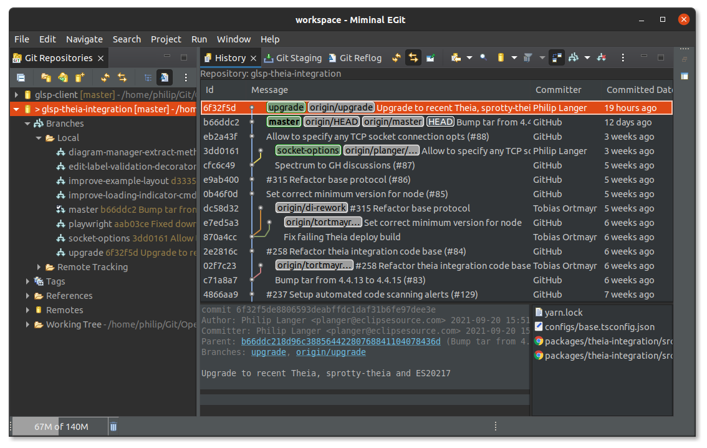

# MeGit

Looking for a powerful, yet easy-to-use, fully open-source user interface for git? Well, there are plenty of [options](https://git-scm.com/downloads/guis/). One of our favorites is [EGit](https://www.eclipse.org/egit/). However, EGit is actually a plug-in for Eclipse rather than a standalone tool, such as GitKraken, etc. Nevertheless, even in projects where we actually use other editors or IDEs than Eclipse, we often found ourselves firing up an Eclipse IDE with EGit just to handle more complex git branch operations, for analysing the git history, and so on.

This made us think... wouldn't EGit be a great git standalone tool if it would be... well, an actual standalone tool?

That's exactly what _MeGit_ is: a minimal standalone application that contains just enough to run EGit conveniently.



# Features

EGit (and hence MeGit) provides tons of features:

- Nice visualization of the git history making it easy to keep a good overview when analyzing, merging or rebasing branches, cherry-picking commits, changing the git history, etc.
- Interactive rebasing support
- Easy-to-use git staging view
- Support for Gerrit and Github
- Support for GitFlow operations
- and much more.

Please refer to the [EGit user guide](https://wiki.eclipse.org/EGit/User_Guide) to learn more.

MeGit intends to make it easy to just use EGit. It hence doesn't add any functionality itself, but only builds EGit as a standalone application with the minimal dependencies. Thus, start up should be fast. Just open MeGit and add the git repositories you care about. There is no need to import them as Eclipse projects. Just use the EGit perspective and directly handle your git tasks on the imported git repositories.

# Installing MeGit

Download the archive for your operating system from the [releases](https://github.com/eclipsesource/megit/releases), unpack the archive and run the `megit` or `megit.exe`. You'll need to select a workspace location to store your metadata.

MeGit requires Java 17 or higher to be installed on your system.

# Building

You'll need maven installed on your system. Once it is installed, run

```
cd com.eclipsesource.megit.parent
mvn clean install
```

The runnable product will be available in `com.eclipsesource.megit.product/target` for your platform. Just extract the archive and run `megit`.

# Changelog

- 0.0.1 Initial release based on Eclipse EGit 2020-12
- 0.0.2 Based on Eclipse EGit 2020-12
  - Git perspective as default and dark theme by default (#7)
  - Miminize editor area by default and fix of #8 (#9)
- 0.0.3 Update to Eclipse EGit 2021-03
- 0.0.4 Update to Eclipse EGit 2021-09
- 0.1.0 Update to Eclipse EGit 2021-12
- 0.2.0 Update to Eclipse EGit 2022-06
- 0.3.0 Update to Eclipse EGit 2022-12
- 0.4.0 Update to Eclipse EGit 2023-06
- 0.5.0 Update to Eclipse EGit 2023-09
  - Add Git LFS support
